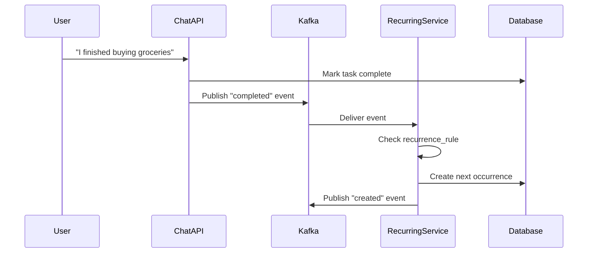

# Phase V: Event Streaming Contract

**Type**: Kafka/Dapr Event Schema
**Broker**: Redpanda Cloud (Kafka-compatible)
**Runtime**: Dapr

## Kafka Topics

| Topic | Partitions | Retention | Purpose |
|-------|------------|-----------|---------|
| task-events | 3 | 7 days | All task CRUD operations |
| reminders | 1 | 1 day | Due date reminder triggers |
| task-updates | 3 | 1 hour | Real-time UI sync (WebSocket bridge) |

## Event Schemas

### TaskEvent (task-events topic)

```json
{
  "$schema": "http://json-schema.org/draft-07/schema#",
  "type": "object",
  "required": ["id", "event_type", "task_id", "user_id", "timestamp"],
  "properties": {
    "id": {
      "type": "string",
      "format": "uuid",
      "description": "Unique event ID"
    },
    "event_type": {
      "type": "string",
      "enum": ["created", "updated", "completed", "deleted", "uncompleted"],
      "description": "Type of task operation"
    },
    "task_id": {
      "type": "integer",
      "description": "Task ID affected"
    },
    "task_data": {
      "type": "object",
      "description": "Full task state after operation"
    },
    "user_id": {
      "type": "string",
      "description": "User who performed the action"
    },
    "timestamp": {
      "type": "string",
      "format": "date-time",
      "description": "When the event occurred"
    }
  }
}
```

**Example Events**:

```json
// Task Created
{
  "id": "550e8400-e29b-41d4-a716-446655440000",
  "event_type": "created",
  "task_id": 1,
  "task_data": {
    "id": 1,
    "title": "Buy groceries",
    "description": null,
    "completed": false,
    "priority": "medium",
    "tags": [],
    "due_date": "2025-01-02T10:00:00Z",
    "recurrence_rule": null,
    "user_id": "user-uuid",
    "created_at": "2025-01-01T00:00:00Z",
    "updated_at": "2025-01-01T00:00:00Z"
  },
  "user_id": "user-uuid",
  "timestamp": "2025-01-01T00:00:00Z"
}

// Task Completed
{
  "id": "550e8400-e29b-41d4-a716-446655440001",
  "event_type": "completed",
  "task_id": 1,
  "task_data": {
    "id": 1,
    "title": "Buy groceries",
    "completed": true,
    ...
  },
  "user_id": "user-uuid",
  "timestamp": "2025-01-01T12:00:00Z"
}
```

### ReminderEvent (reminders topic)

```json
{
  "$schema": "http://json-schema.org/draft-07/schema#",
  "type": "object",
  "required": ["task_id", "title", "remind_at", "user_id"],
  "properties": {
    "task_id": {
      "type": "integer"
    },
    "title": {
      "type": "string"
    },
    "due_date": {
      "type": "string",
      "format": "date-time"
    },
    "remind_at": {
      "type": "string",
      "format": "date-time"
    },
    "user_id": {
      "type": "string"
    }
  }
}
```

**Example**:

```json
{
  "task_id": 1,
  "title": "Buy groceries",
  "due_date": "2025-01-02T10:00:00Z",
  "remind_at": "2025-01-02T09:00:00Z",
  "user_id": "user-uuid"
}
```

## Dapr Components

### Kafka Pub/Sub

```yaml
apiVersion: dapr.io/v1alpha1
kind: Component
metadata:
  name: kafka-pubsub
  namespace: todo-app
spec:
  type: pubsub.kafka
  version: v1
  metadata:
    - name: brokers
      value: "redpanda:9092"
    - name: consumerGroup
      value: "todo-service"
    - name: authRequired
      value: "false"
```

### State Store (PostgreSQL)

```yaml
apiVersion: dapr.io/v1alpha1
kind: Component
metadata:
  name: statestore
  namespace: todo-app
spec:
  type: state.postgresql
  version: v1
  metadata:
    - name: connectionString
      secretKeyRef:
        name: todo-secrets
        key: database-url
```

### Secret Store

```yaml
apiVersion: dapr.io/v1alpha1
kind: Component
metadata:
  name: kubernetes-secrets
  namespace: todo-app
spec:
  type: secretstores.kubernetes
  version: v1
```

## Publishing Events via Dapr

```python
# backend/app/events.py
import httpx
import uuid
from datetime import datetime

DAPR_HTTP_PORT = 3500

async def publish_task_event(event_type: str, task_data: dict, user_id: str):
    """Publish task event via Dapr."""
    event = {
        "id": str(uuid.uuid4()),
        "event_type": event_type,
        "task_id": task_data.get("id"),
        "task_data": task_data,
        "user_id": user_id,
        "timestamp": datetime.utcnow().isoformat()
    }

    async with httpx.AsyncClient() as client:
        await client.post(
            f"http://localhost:{DAPR_HTTP_PORT}/v1.0/publish/kafka-pubsub/task-events",
            json=event
        )
```

## Subscribing to Events via Dapr

```python
# backend/app/subscribers.py
from fastapi import APIRouter, Request

router = APIRouter()

@router.post("/dapr/subscribe")
async def subscribe():
    """Dapr subscription configuration."""
    return [
        {
            "pubsubname": "kafka-pubsub",
            "topic": "task-events",
            "route": "/events/tasks"
        },
        {
            "pubsubname": "kafka-pubsub",
            "topic": "reminders",
            "route": "/events/reminders"
        }
    ]

@router.post("/events/tasks")
async def handle_task_event(request: Request):
    """Process task events."""
    event = await request.json()
    data = event.get("data", {})
    event_type = data.get("event_type")

    # Handle recurring task completion
    if event_type == "completed":
        task_data = data.get("task_data", {})
        if task_data.get("recurrence_rule"):
            await create_next_occurrence(task_data)

    return {"status": "SUCCESS"}

@router.post("/events/reminders")
async def handle_reminder(request: Request):
    """Process reminder events."""
    event = await request.json()
    data = event.get("data", {})

    # Send notification (webhook, email, push, etc.)
    await send_notification(data)

    return {"status": "SUCCESS"}
```

## Recurring Task Flow



## Reminder Scheduling (Dapr Jobs API)

```python
import httpx
from datetime import datetime

async def schedule_reminder(task_id: int, remind_at: datetime, user_id: str):
    """Schedule reminder using Dapr Jobs API."""
    await httpx.post(
        f"http://localhost:3500/v1.0-alpha1/jobs/reminder-task-{task_id}",
        json={
            "dueTime": remind_at.strftime("%Y-%m-%dT%H:%M:%SZ"),
            "data": {
                "task_id": task_id,
                "user_id": user_id,
                "type": "reminder"
            }
        }
    )

# Handle callback
@app.post("/api/jobs/trigger")
async def handle_job_trigger(request: Request):
    job_data = await request.json()
    if job_data["data"]["type"] == "reminder":
        await publish_event("reminders", "reminder.due", job_data["data"])
    return {"status": "SUCCESS"}
```

## Event Consumers

| Consumer | Topic | Action |
|----------|-------|--------|
| RecurringTaskService | task-events (completed) | Create next occurrence |
| NotificationService | reminders | Send user notification |
| AnalyticsService | task-events (all) | Track usage metrics |
| WebSocketBridge | task-updates | Push to connected clients |

## Error Handling

### Dead Letter Topic

Failed events are routed to `task-events-dlq`:

```yaml
# Dapr component with dead letter
apiVersion: dapr.io/v1alpha1
kind: Component
metadata:
  name: kafka-pubsub
spec:
  type: pubsub.kafka
  metadata:
    - name: brokers
      value: "redpanda:9092"
    - name: deadLetterTopic
      value: "task-events-dlq"
    - name: maxRetries
      value: "3"
```

### Retry Policy

- Max retries: 3
- Backoff: Exponential (1s, 2s, 4s)
- After 3 failures: Route to DLQ

## Redpanda Cloud Connection

```python
from kafka import KafkaProducer
import json

producer = KafkaProducer(
    bootstrap_servers="YOUR-CLUSTER.cloud.redpanda.com:9092",
    security_protocol="SASL_SSL",
    sasl_mechanism="SCRAM-SHA-256",
    sasl_plain_username="YOUR-USERNAME",
    sasl_plain_password="YOUR-PASSWORD",
    value_serializer=lambda v: json.dumps(v).encode('utf-8')
)
```

**Note**: In production, use Dapr abstraction to avoid direct Kafka client code.
