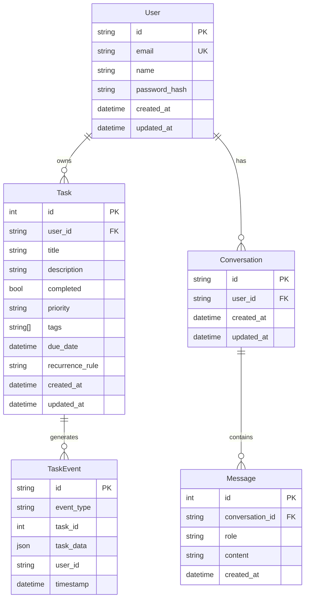

# Data Model: Hackathon Todo Evolution

**Phase**: 1 - Design
**Date**: 2025-12-29
**Status**: Complete

## Entity Overview



## Phase I: In-Memory Model

### Task (Python dataclass)

```python
from dataclasses import dataclass, field
from datetime import datetime
from typing import Optional
from enum import Enum

class Priority(str, Enum):
    LOW = "low"
    MEDIUM = "medium"
    HIGH = "high"

@dataclass
class Task:
    id: int
    title: str
    description: Optional[str] = None
    completed: bool = False
    priority: Priority = Priority.MEDIUM
    due_date: Optional[datetime] = None
    created_at: datetime = field(default_factory=datetime.now)
```

**Validation Rules**:
- `id`: Auto-generated, positive integer
- `title`: Required, 1-200 characters
- `description`: Optional, max 1000 characters
- `priority`: One of "low", "medium", "high"
- `due_date`: Optional, must be future date if provided

## Phase II-V: Database Models

### User (SQLModel)

```python
from sqlmodel import SQLModel, Field
from datetime import datetime
from typing import Optional

class User(SQLModel, table=True):
    id: Optional[str] = Field(default=None, primary_key=True)
    email: str = Field(unique=True, index=True)
    name: str
    password_hash: str
    created_at: datetime = Field(default_factory=datetime.utcnow)
    updated_at: datetime = Field(default_factory=datetime.utcnow)
```

**Constraints**:
- `id`: UUID string, primary key
- `email`: Unique, valid email format
- `name`: Required, 1-100 characters
- `password_hash`: Bcrypt hash, never exposed

**Note**: Better Auth manages User table directly. This schema is for reference.

### Task (SQLModel)

```python
from sqlmodel import SQLModel, Field, Relationship
from datetime import datetime
from typing import Optional
from enum import Enum

class Priority(str, Enum):
    LOW = "low"
    MEDIUM = "medium"
    HIGH = "high"

class TaskBase(SQLModel):
    title: str = Field(min_length=1, max_length=200)
    description: Optional[str] = Field(default=None, max_length=1000)
    completed: bool = Field(default=False)
    priority: Priority = Field(default=Priority.MEDIUM)
    due_date: Optional[datetime] = None
    tags: list[str] = Field(default=[])
    recurrence_rule: Optional[str] = None  # iCal RRULE format

class Task(TaskBase, table=True):
    id: Optional[int] = Field(default=None, primary_key=True)
    user_id: str = Field(foreign_key="user.id", index=True)
    created_at: datetime = Field(default_factory=datetime.utcnow)
    updated_at: datetime = Field(default_factory=datetime.utcnow)

class TaskCreate(TaskBase):
    pass

class TaskUpdate(SQLModel):
    title: Optional[str] = Field(default=None, min_length=1, max_length=200)
    description: Optional[str] = Field(default=None, max_length=1000)
    completed: Optional[bool] = None
    priority: Optional[Priority] = None
    due_date: Optional[datetime] = None
    tags: Optional[list[str]] = None
    recurrence_rule: Optional[str] = None

class TaskRead(TaskBase):
    id: int
    user_id: str
    created_at: datetime
    updated_at: datetime
```

**Constraints**:
- `id`: Auto-increment integer, primary key
- `user_id`: Foreign key to User.id, indexed for query performance
- `title`: Required, 1-200 characters
- `tags`: Array of strings, stored as JSON in PostgreSQL
- `recurrence_rule`: iCal RRULE format (e.g., "FREQ=WEEKLY;BYDAY=MO,WE,FR")

**Indexes**:
- `user_id` (B-tree) - Filter tasks by user
- `(user_id, completed)` - Filter incomplete tasks
- `(user_id, due_date)` - Sort by due date

### Conversation (SQLModel)

```python
from sqlmodel import SQLModel, Field
from datetime import datetime
from typing import Optional

class Conversation(SQLModel, table=True):
    id: Optional[str] = Field(default=None, primary_key=True)  # UUID
    user_id: str = Field(foreign_key="user.id", index=True)
    created_at: datetime = Field(default_factory=datetime.utcnow)
    updated_at: datetime = Field(default_factory=datetime.utcnow)

class ConversationRead(SQLModel):
    id: str
    user_id: str
    created_at: datetime
    updated_at: datetime
```

**Constraints**:
- `id`: UUID string, primary key
- `user_id`: Foreign key, indexed

### Message (SQLModel)

```python
from sqlmodel import SQLModel, Field
from datetime import datetime
from typing import Optional
from enum import Enum

class Role(str, Enum):
    USER = "user"
    ASSISTANT = "assistant"
    SYSTEM = "system"

class Message(SQLModel, table=True):
    id: Optional[int] = Field(default=None, primary_key=True)
    conversation_id: str = Field(foreign_key="conversation.id", index=True)
    role: Role
    content: str
    created_at: datetime = Field(default_factory=datetime.utcnow)

class MessageCreate(SQLModel):
    role: Role
    content: str

class MessageRead(SQLModel):
    id: int
    conversation_id: str
    role: Role
    content: str
    created_at: datetime
```

**Constraints**:
- `id`: Auto-increment, primary key
- `conversation_id`: Foreign key, indexed for conversation retrieval
- `role`: Enum - user, assistant, or system
- `content`: Text, no limit (stored as TEXT in PostgreSQL)

### TaskEvent (Kafka/Phase V)

```python
from pydantic import BaseModel
from datetime import datetime
from typing import Optional, Any

class EventType(str, Enum):
    CREATED = "created"
    UPDATED = "updated"
    COMPLETED = "completed"
    DELETED = "deleted"
    REMINDER = "reminder"

class TaskEvent(BaseModel):
    id: str  # UUID
    event_type: EventType
    task_id: int
    task_data: dict[str, Any]
    user_id: str
    timestamp: datetime

# Kafka topic: task-events
# Example event:
# {
#     "id": "uuid-string",
#     "event_type": "created",
#     "task_id": 1,
#     "task_data": {"title": "Buy groceries", ...},
#     "user_id": "user-uuid",
#     "timestamp": "2025-01-01T00:00:00Z"
# }
```

**Kafka Topics**:
- `task-events`: All CRUD operations
- `reminders`: Due date/reminder triggers

## State Transitions

### Task Lifecycle

```
┌─────────┐     complete()     ┌───────────┐
│ PENDING │ ─────────────────► │ COMPLETED │
└─────────┘                    └───────────┘
     │                              │
     │ update()                     │ reopen()
     ▼                              ▼
┌─────────┐     complete()     ┌───────────┐
│ PENDING │ ◄───────────────── │ COMPLETED │
└─────────┘                    └───────────┘
     │
     │ delete()
     ▼
┌─────────┐
│ DELETED │ (soft delete via event, hard delete in DB)
└─────────┘
```

### Recurring Task Behavior (Phase V)

When a recurring task is completed:
1. Publish `completed` event to Kafka
2. Consumer calculates next occurrence from `recurrence_rule`
3. Consumer creates new task instance with updated `due_date`
4. Publish `created` event for new instance

## Database Schema (PostgreSQL)

```sql
-- Better Auth manages this table
CREATE TABLE "user" (
    id VARCHAR(255) PRIMARY KEY,
    email VARCHAR(255) UNIQUE NOT NULL,
    name VARCHAR(100) NOT NULL,
    password_hash VARCHAR(255) NOT NULL,
    created_at TIMESTAMP DEFAULT CURRENT_TIMESTAMP,
    updated_at TIMESTAMP DEFAULT CURRENT_TIMESTAMP
);

CREATE TABLE task (
    id SERIAL PRIMARY KEY,
    user_id VARCHAR(255) NOT NULL REFERENCES "user"(id) ON DELETE CASCADE,
    title VARCHAR(200) NOT NULL,
    description TEXT,
    completed BOOLEAN DEFAULT FALSE,
    priority VARCHAR(10) DEFAULT 'medium',
    tags JSONB DEFAULT '[]',
    due_date TIMESTAMP,
    recurrence_rule VARCHAR(255),
    created_at TIMESTAMP DEFAULT CURRENT_TIMESTAMP,
    updated_at TIMESTAMP DEFAULT CURRENT_TIMESTAMP
);

CREATE INDEX idx_task_user_id ON task(user_id);
CREATE INDEX idx_task_user_completed ON task(user_id, completed);
CREATE INDEX idx_task_user_due_date ON task(user_id, due_date);

CREATE TABLE conversation (
    id VARCHAR(255) PRIMARY KEY,
    user_id VARCHAR(255) NOT NULL REFERENCES "user"(id) ON DELETE CASCADE,
    created_at TIMESTAMP DEFAULT CURRENT_TIMESTAMP,
    updated_at TIMESTAMP DEFAULT CURRENT_TIMESTAMP
);

CREATE INDEX idx_conversation_user_id ON conversation(user_id);

CREATE TABLE message (
    id SERIAL PRIMARY KEY,
    conversation_id VARCHAR(255) NOT NULL REFERENCES conversation(id) ON DELETE CASCADE,
    role VARCHAR(20) NOT NULL,
    content TEXT NOT NULL,
    created_at TIMESTAMP DEFAULT CURRENT_TIMESTAMP
);

CREATE INDEX idx_message_conversation_id ON message(conversation_id);
```

## Validation Summary

| Entity | Field | Validation |
|--------|-------|------------|
| Task | title | Required, 1-200 chars |
| Task | description | Optional, max 1000 chars |
| Task | priority | Enum: low, medium, high |
| Task | due_date | Optional, ISO datetime |
| Task | recurrence_rule | Optional, valid iCal RRULE |
| User | email | Required, valid email, unique |
| User | name | Required, 1-100 chars |
| Message | role | Enum: user, assistant, system |
| Message | content | Required, no limit |
