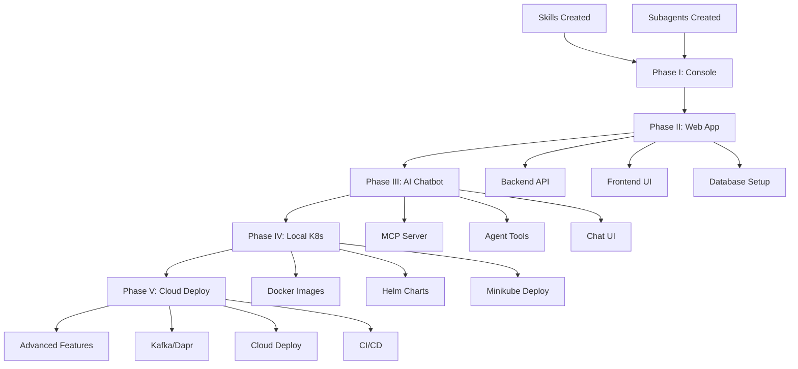

# Implementation Plan: Hackathon Todo Evolution

**Branch**: `001-hackathon-todo-evolution` | **Date**: 2025-12-29 | **Spec**: [spec.md](./spec.md)
**Input**: Feature specification from `/specs/001-hackathon-todo-evolution/spec.md`
**Target**: Complete all 5 phases (1000 pts) + Bonus features (+700 pts) = 1700 potential points

## Summary

Build a 5-phase Todo application evolution from in-memory Python console app to cloud-native AI chatbot. The project demonstrates Spec-Driven Development using Claude Code with no manual coding. Implementation leverages reusable Skills (`.claude/skills/`) and Subagents (`.claude/agents/`) per Constitution Principles II and III, with Context7 MCP for up-to-date documentation.

**Primary Requirements**:

- Phase I: Python console CRUD (100 pts)
- Phase II: Full-stack web app with FastAPI + Next.js + Neon DB (150 pts)
- Phase III: AI chatbot with OpenAI Agents SDK + MCP (200 pts)
- Phase IV: Local K8s deployment with Docker + Helm + Minikube (250 pts)
- Phase V: Cloud deployment with Kafka + Dapr (300 pts)
- Bonus: Subagents (+200 pts) + Cloud Blueprints (+200 pts) + Urdu Support (+100 pts) + Voice Commands (+200 pts)

## Technical Context

**Language/Version**: Python 3.13+ (backend), TypeScript 5.x (frontend)
**Primary Dependencies**:

- Backend: FastAPI, SQLModel, Pydantic, OpenAI Agents SDK, MCP SDK
- Frontend: Next.js 15+, Better Auth, Tailwind CSS, OpenAI ChatKit
- Infrastructure: Docker, Helm, Dapr, Kafka/Redpanda

**Storage**: Neon Serverless PostgreSQL (Phases II-V), In-memory dict (Phase I)
**Testing**: pytest (backend), Jest/Vitest (frontend)
**Target Platform**: Linux/WSL2 (dev), Kubernetes (prod)
**Project Type**: Web application (monorepo: backend/ + frontend/)
**Performance Goals**:

- API response <200ms p95
- Chat response <5s
- 100 concurrent users
- 99% uptime on K8s

**Constraints**:

- No manual code writing
- All code generated via Claude Code from specs
- Sequential phase completion required
- JWT tokens for authentication

**Scale/Scope**: Single user to multi-tenant, 5 phases, ~50 endpoints

## Constitution Check

_GATE: Must pass before Phase 0 research. Re-check after Phase 1 design._

| Principle                    | Status  | Evidence                                                                 |
| ---------------------------- | ------- | ------------------------------------------------------------------------ |
| I. Spec-Driven Development   | ✅ PASS | spec.md created, plan.md in progress                                     |
| II. Skills & Subagents First | ✅ PASS | `.claude/skills/` (9 skills), `.claude/agents/` (5 phase agents) created |
| III. Context7 Knowledge      | ✅ PASS | Skills populated from Context7 MCP                                       |
| IV. No Manual Coding         | ✅ PASS | All code will be generated via Claude Code                               |
| V. Phase Governance          | ✅ PASS | 5 phases defined with clear boundaries                                   |
| VI. Technology Constraints   | ✅ PASS | Mandatory stack aligned with spec                                        |
| VII. Agent Behavior Rules    | ✅ PASS | Task IDs will be required for all code                                   |
| VIII. Quality Principles     | ✅ PASS | Clean architecture, type hints, error handling planned                   |
| IX. Cloud-Native Readiness   | ✅ PASS | Docker, Helm, K8s, health checks planned                                 |

**Gate Status**: ✅ PASSED - Proceed to Phase 0 Research

## Project Structure

### Documentation (this feature)

```text
specs/001-hackathon-todo-evolution/
├── spec.md              # Feature specification
├── plan.md              # This file
├── research.md          # Phase 0 output
├── data-model.md        # Phase 1 output
├── quickstart.md        # Phase 1 output
├── contracts/           # Phase 1 output
│   ├── phase1-cli.md
│   ├── phase2-rest-api.md
│   ├── phase3-chat-api.md
│   ├── phase4-helm.md
│   └── phase5-events.md
└── tasks.md             # Phase 2 output (/sp.tasks)
```

### Source Code (repository root)

```text
# Phase I: Console Application
src/
├── models/
│   └── task.py              # Task dataclass
├── services/
│   └── task_store.py        # In-memory CRUD operations
├── cli/
│   └── main.py              # Rich console interface
└── __init__.py

tests/
├── unit/
│   └── test_task_store.py
└── integration/
    └── test_cli.py

# Phase II-V: Web Application (monorepo)
backend/
├── app/
│   ├── __init__.py
│   ├── main.py              # FastAPI entry point
│   ├── models.py            # SQLModel entities
│   ├── database.py          # Neon connection
│   ├── auth.py              # JWT verification
│   ├── routes/
│   │   ├── tasks.py         # Task CRUD endpoints
│   │   └── chat.py          # Chat API endpoint
│   ├── services/
│   │   └── task_service.py  # Business logic
│   └── mcp_server/
│       └── server.py        # MCP tools for AI
├── tests/
└── pyproject.toml

frontend/
├── app/
│   ├── layout.tsx
│   ├── page.tsx             # Landing page
│   ├── dashboard/
│   │   └── page.tsx         # Task list UI
│   ├── chat/
│   │   └── page.tsx         # Chatbot UI
│   └── api/
│       └── auth/[...all]/route.ts  # Better Auth
├── components/
│   ├── task-list.tsx
│   ├── task-form.tsx
│   └── chat.tsx
├── lib/
│   ├── auth.ts              # Better Auth config
│   └── api.ts               # Backend API client
└── package.json

# Phase IV-V: Infrastructure
helm/
└── todo-app/
    ├── Chart.yaml
    ├── values.yaml
    ├── values-cloud.yaml
    └── templates/
        ├── backend-deployment.yaml
        ├── backend-service.yaml
        ├── frontend-deployment.yaml
        ├── frontend-service.yaml
        ├── configmap.yaml
        ├── secret.yaml
        └── ingress.yaml

dapr-components/
├── kafka-pubsub.yaml
├── statestore.yaml
└── secretstore.yaml

docker/
├── backend.Dockerfile
└── frontend.Dockerfile

.github/
└── workflows/
    └── deploy.yaml          # CI/CD pipeline
```

**Structure Decision**: Monorepo with `backend/` and `frontend/` separation. Phase I code in `src/` will be refactored to `backend/` in Phase II. Infrastructure code in `helm/`, `dapr-components/`, and `docker/`.

## Phase Implementation Strategy

### Phase I: Console Application (100 pts)

**Reference**: `.claude/agents/phase1-console/agent.md`
**Skills**: Python native
**Duration**: 1 day

**Key Deliverables**:

1. Task dataclass with id, title, description, completed, priority, due_date
2. TaskStore with in-memory dict and CRUD methods
3. Rich console UI with menu-driven interface
4. pytest unit tests

**Technical Approach**:

```
UV init → Create models → Create store → Create CLI → Write tests
```

### Phase II: Full-Stack Web Application (150 pts)

**Reference**: `.claude/agents/phase2-fullstack/agent.md`
**Skills**: `.claude/skills/fastapi/`, `.claude/skills/nextjs/`, `.claude/skills/sqlmodel/`, `.claude/skills/better-auth/`
**Duration**: 2-3 days

**Key Deliverables**:

1. FastAPI backend with SQLModel + Neon PostgreSQL
2. Next.js 15 frontend with App Router
3. Better Auth for JWT authentication
4. User isolation (each user sees only their tasks)
5. REST API endpoints per spec

**Technical Approach**:

```
Backend: SQLModel models → Database setup → FastAPI routes → JWT auth
Frontend: Next.js setup → Better Auth → API client → Task list UI
```

### Phase III: AI Chatbot (200 pts)

**Reference**: `.claude/agents/phase3-ai-chatbot/agent.md`
**Skills**: `.claude/skills/openai-agents-sdk/`, `.claude/skills/mcp-sdk/`
**Duration**: 2-3 days

**Key Deliverables**:

1. MCP server with task operation tools (add, list, complete, delete, update)
2. OpenAI Agents SDK integration with function tools
3. Chat API endpoint with conversation persistence
4. ChatKit frontend component
5. Stateless architecture

**Technical Approach**:

```
MCP Server → Agent tools → Chat endpoint → Conversation persistence → ChatKit UI
```

### Phase IV: Local Kubernetes (250 pts)

**Reference**: `.claude/agents/phase4-kubernetes/agent.md`
**Skills**: `.claude/skills/helm/`
**Duration**: 2-3 days

**Key Deliverables**:

1. Multi-stage Dockerfiles for frontend and backend
2. Helm chart with all K8s resources
3. Health checks (readiness/liveness probes)
4. Minikube deployment
5. kubectl-ai and kagent integration

**Technical Approach**:

```
Dockerfiles → Build images → Helm chart → Deploy to Minikube → Verify
```

### Phase V: Cloud Deployment (300 pts)

**Reference**: `.claude/agents/phase5-cloud/agent.md`
**Skills**: `.claude/skills/dapr/`, `.claude/skills/kafka-python/`
**Duration**: 3-4 days

**Key Deliverables**:

1. Advanced features: recurring tasks, reminders, priorities, tags, search
2. Kafka/Redpanda event streaming
3. Dapr components for Pub/Sub, State, Secrets
4. Cloud K8s deployment (DOKS/AKS/GKE)
5. GitHub Actions CI/CD

**Technical Approach**:

```
Advanced features → Kafka topics → Dapr components → Cloud deploy → CI/CD
```

## Bonus Points Strategy (+400 pts)

### Subagents & Skills (+200 pts) ✅ COMPLETED

**Evidence**:

- `.claude/skills/` with 9 technology skills
- `.claude/agents/` with 5 phase-specific subagents
- All populated from Context7 MCP documentation

### Cloud-Native Blueprints (+200 pts) - IN PROGRESS

**Strategy**:

- Create reusable Helm chart templates
- Create Dapr component blueprints
- Document as Agent Skills for reuse

**Files to Create**:

- `.claude/skills/cloud-blueprints/SKILL.md`
- Templates for common K8s patterns

## Risk Assessment

| Risk                     | Mitigation                                      |
| ------------------------ | ----------------------------------------------- |
| Context7 MCP unavailable | Skills already cached in `.claude/skills/`      |
| Neon DB free tier limits | Monitor usage, optimize queries                 |
| OpenAI API costs         | Use GPT-4o-mini where possible, cache responses |
| K8s complexity           | Use kubectl-ai and kagent for assistance        |
| Time pressure            | Prioritize core requirements before bonus       |

## Complexity Tracking

> No constitution violations requiring justification

| Aspect                 | Complexity Level | Justification                           |
| ---------------------- | ---------------- | --------------------------------------- |
| Monorepo structure     | Medium           | Required for frontend + backend + infra |
| 5-phase evolution      | High             | Hackathon requirement                   |
| Event-driven (Phase V) | High             | Required for advanced features          |

## Dependencies & Execution Order



## Next Steps

1. Generate `research.md` (Phase 0)
2. Generate `data-model.md` (Phase 1)
3. Generate `contracts/` (Phase 1)
4. Generate `quickstart.md` (Phase 1)
5. Run `/sp.tasks` to create task breakdown
6. Run `/sp.implement` starting with Phase I
